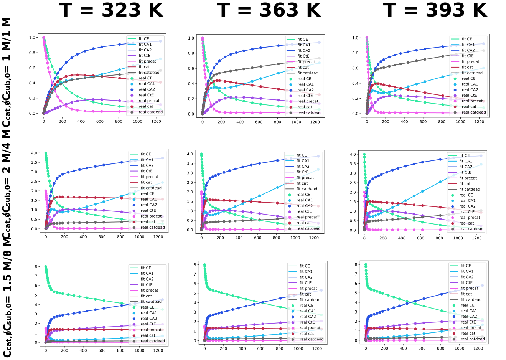
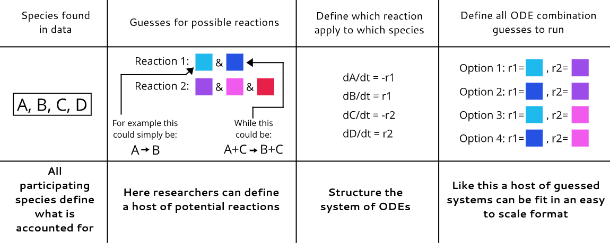

# ODE_Fitting_repository
This repository is for screening and fitting chemical kinetic data with differential based models. Differential based models go beyond pure statistics and include the chemical effects in the evaluation. Making a connection between chemical data and its associated chemical systems could be valuable for reducing speculation.

The program consists of chemscreen and chemfit. Chemscreen is for screening a lot of similar systems on data consecutively to find agreeable models, Chemfit is to take those models and the the absolute best fit. If the fit is accurate it will result in uncovering all rate constants and even activation energies and Arrhenius pre-factors.

## Required packages
``` 
pip install numpy
pip install scipy
pip install lmfit
pip install scikit-learn (import as sklearn)
pip install random
pip install progressbar2 (import as progressbar)
```



## Chemscreen
This is a tool for screening many alike chemical systems. The principle is explained in the figure



### App
There is an application that shows in simple terms what the program does, it is purely illustrative, and not super powerful, but fun to tune so that one can see what the program does.

### With_functions
The with functions document contains all documented and commented functions and code executions so one can get familiar with the program

### Clean
The clean document is the same as the with functions document, but without comments, and with the program as an import so that it is sleek.

### Csv_import
The CSV import document is an example of how to load in your own data and fit it with the program.

## Chemfit
This program is for getting high quality fits for the systems screened with chemscreen.

### From_research
This document shows how I used the code for my own research

### With_functions
This is the commented and fully documented version of the code for understanding, and tweaking if needed

### Clean
The clean document is the same as the with functions document, but without comments, and with the program as an import so that it it sleek. This also used a CSV import to get the data, to show how that works for Chemfit.

## True_data
Reference for the constants used to make all the data, and thus the constants the programs try to find.

## Bayesian_optimizer_example
A document to show how the initial conditions of a reaction can be optimized based on the kinetic constants found, and the differential system used
with Bayesian optimization.
## Paper_data_algorithm
Serves as documentation for the associated paper from this program.
